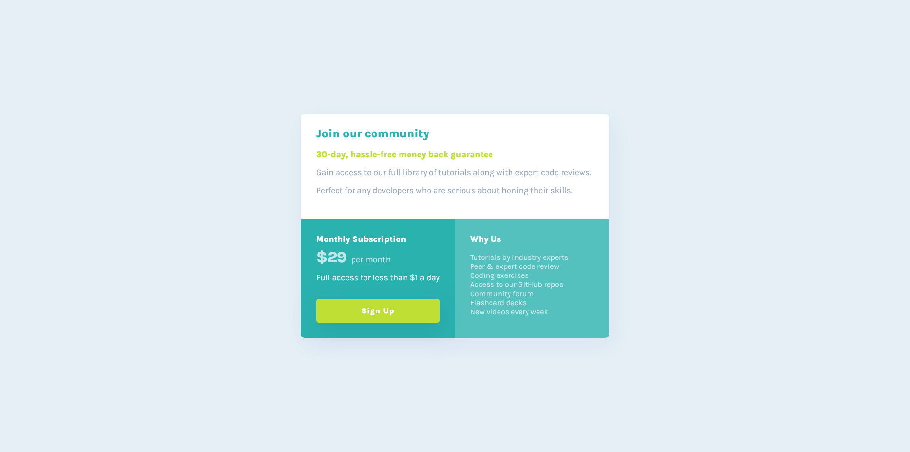

# Frontend Mentor - Single price grid component solution

This is a solution to the [Single price grid component challenge on Frontend Mentor](https://www.frontendmentor.io/challenges/single-price-grid-component-5ce41129d0ff452fec5abbbc). Frontend Mentor challenges help you improve your coding skills by building realistic projects. 

## Table of contents

- [Overview](#overview)
  - [The challenge](#the-challenge)
  - [Screenshot](#screenshot)
  - [Links](#links)
- [My process](#my-process)
  - [Built with](#built-with)
  - [What I learned](#what-i-learned)
  - [Useful resources](#useful-resources)
- [Author](#author)
- [Acknowledgments](#acknowledgments)

## Overview

### The challenge

Users should be able to:

- View the optimal layout for the component depending on their device's screen size
- See a hover state on desktop for the Sign Up call-to-action

### Screenshot

The desktop view of the solution is a grid with the first item spanning two columns.

The mobile view spans all the items to fill the 2 column desktop grid.  I am currently contemplating whether mobile first or desktop first is a better option.  I've been using mobile first, but I somehow feel it's easier to make changes to suit the mobile view than the other way around, as the desktop view has the most complexity.

### Links

- Solution URL: [Github repository](https://github.com/funficient/fem-single-price-grid-component)
- Live Site URL: [Live Site](https://funficient.github.io/fem-single-price-grid-component/)

## My process

### Built with

- Semantic HTML5 markup
- CSS custom properties
- CSS Grid

As explained above, I use a simple 2 column grid and span the mobile view rather than changing the grid layout.

### What I learned

This was a good practice round for using grid.  I didn't learn anything new, but it was a good challenge.

### Useful resources

- [CSS Grid Cheatsheet](https://grid.malven.co/) - A nice summary of how the results look for each option when you use grid.

## Author

- Website - [fun-fi-cient](https://www.funficient.com)
- Frontend Mentor - [@funficient](https://www.frontendmentor.io/profile/funficient)

## Acknowledgments

Thank you to the supportive and kind Frontend Mentor community for always giving feedback promptly!